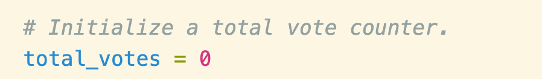

# Election_Analysis
## Overview of Election Audit
This project helps a Colorado Board of Elections employee, Tom, to tabulate the result for the U.S. Congressional precinct in Colorado. This analysis uncovered multiple data based on the Python automatic process, including the total number of votes cast, the total number of votes for each candidate, the percentage of votes for each candidate, and the election winner.

## Election-Audit Result
* How many votes were cast in this congressional election? 
**The total number of votes is 369,711.** 

It is equal to the total number of rows in election_results.csv based on the for loop method. This loop iterates through each row and increments the "total_votes" variable by 1.

* Provide a breakdown of the number of votes and the percentage of total votes for each county in the precinct. 
**Result of each county**

Upon picture shows that the process retrieve the county's total vote count, and use the equation to calculate the vote percentage of each county. Followed by the f-string in the next step, so the percentage is formatted to one decimal place.

* Which county had the largest number of votes?
The largest number of votes is Denver.
Applied the if statement to determine the couty with the largest number of vote by compare the percentage amount. 

**Largest number of votes**

* Provide a breakdown of the number of votes and the percentage of the total votes each candidate received.
**Result of each candidate**

* Which candidate won the election, what was their vote count, and what was their percentage of the total votes? 
Diana DeGette won the election with the 73.8% of the total votes. The code uses the seperate f string to identify the winner clearly. 

## Election-Audit Summary
This script can be used in other congressional ditricts and local ditricts elections with the following steps:
1. Save all the data in a Excel document. Data contains the candidate names, state governments' name, and the ballot ID.
2.Retrieve the total number of votes cast.
3.Figure out the complete list of candidates who received votes.
4.Find out each candidate' vote percentage.
5.Indentify the total number of each candidate won.
6.Determine the winner of the state government election based on the vote.
